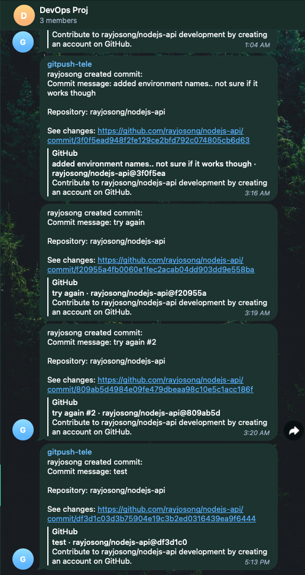
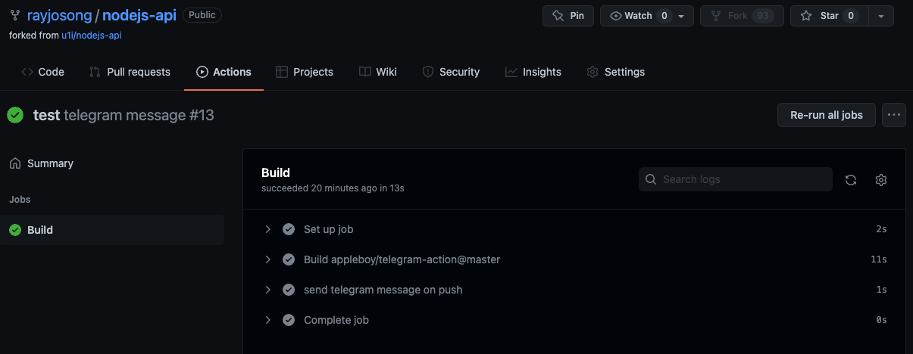

# DevOps Show and Tell Project 2 by Raymond Ong

## CI/CD pipeline implemented using GitHub Actions:

- Upon push, send notification to Telegram Notify by Github user appleboy (appleboy/telegram-action@master)
  Using Mayhem to test REST APIs using Postman Collections
- create docker container (will try to implement after Show And Tell is over)
- push to gcr.io container registry (will try to implement after Show And Tell is over)
- deploy to Google Cloud Run (knative / PaaS) (will try to implement after Show And Tell is over)
  \*\*

## Thought Process

- Trigger an automated workflow for Developers to fulfill Ops side of things, allowing Devs to focus on development
- Telegram Notifications upon pushl; Important to receive readily accessible notifications as a feedback loop confirmation that repo is pushed onto Github
- Using Mayhem to test REST APIs using Postman Collections; preliminary test to ensure APIs are working
- Docker container; Provide isolated, repeatable and consistent test environment to run tests aside from local machine

## Challenges & what can be done better

- Too ambitious and tried implementing too many workflows within pipelines. A more focused approach would have produced better results.
- Not very familiar with YAML so found it difficult to include environment variables within yml files to call env secrets stored in Github
- Learnt that most Github Actions workflow involved environment variables so actually setting them up would be relatively easy once I figured out how to link Github env variables with Github Actions workflow defined within the .yml files

# Currency Exchange API – NodeJS

docker run -d -p 8080:8080 u1ih/nodejs-api

curl -i http://localhost:8080/fx

\*\*

Live endpoint available at: [https://nodejsapi-tgihgzgplq-uc.a.run.app/](https://nodejsapi-tgihgzgplq-uc.a.run.app/)

[https://nodejsapi-tgihgzgplq-uc.a.run.app/fx](https://nodejsapi-tgihgzgplq-uc.a.run.app/fx)

The CI/CD build workflow needs documentation. For now, here is how you connect it to GCP: [https://gcp-examquestions.com/ci-cd-solutions-deploy-to-google-cloud-run-using-github-actions/](https://gcp-examquestions.com/ci-cd-solutions-deploy-to-google-cloud-run-using-github-actions/)

In order for this to be provisioned on your Google Cloud instance, you need to make sure you create/update these GitHub secrets:

- GCP_APPLICATION
- GCP_CREDENTIALS
- GCP_EMAIL
- GCP_PROJECT

You'll also need to activate a couple of APIs in Google Cloud, the first deployment will probably fail and point you into the right direction. Alternatively, you could deploy the first version manually.
